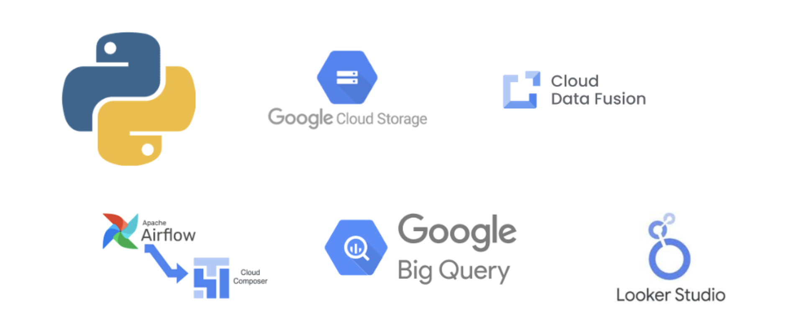
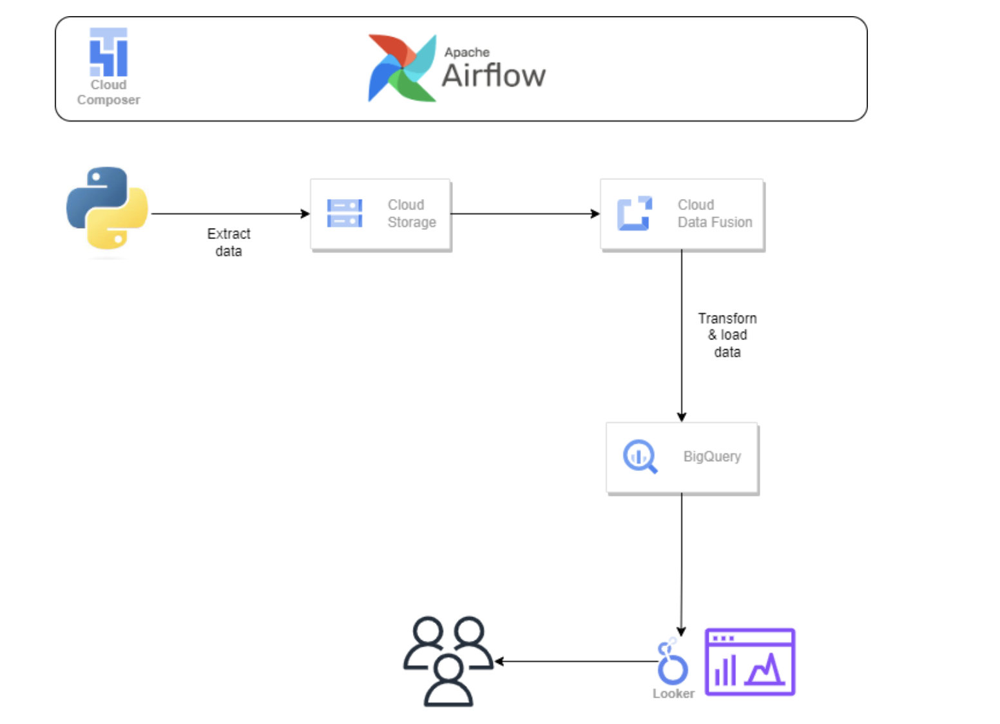
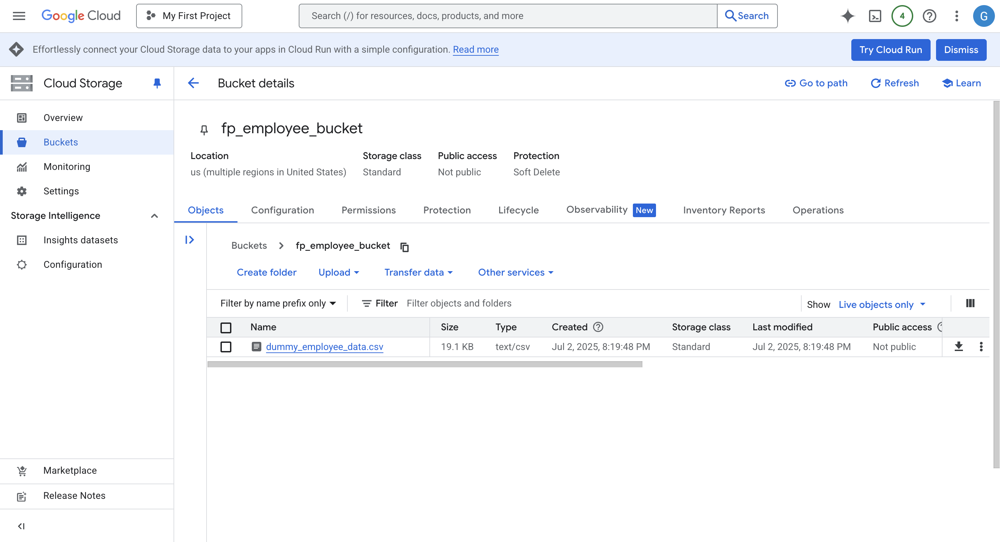
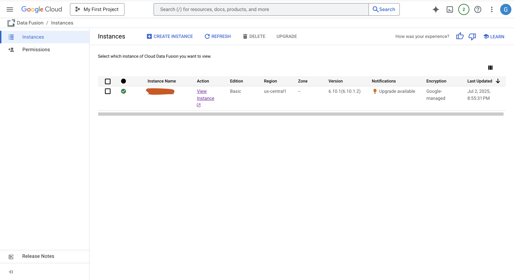
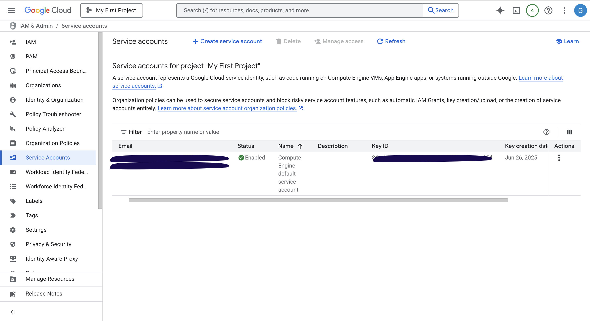
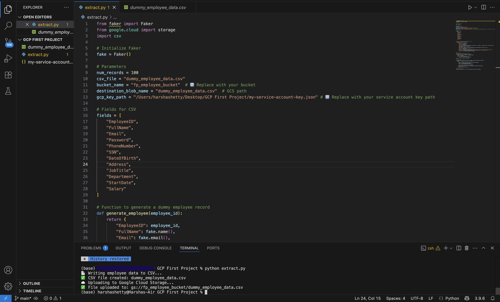
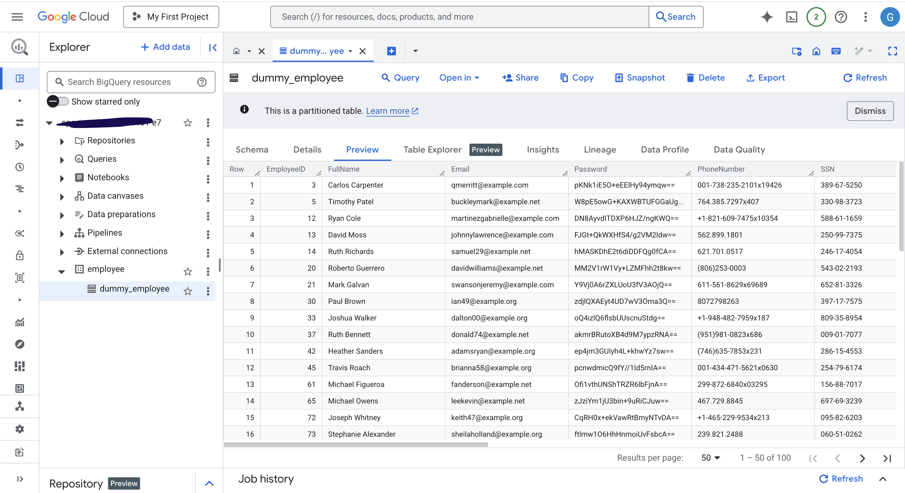
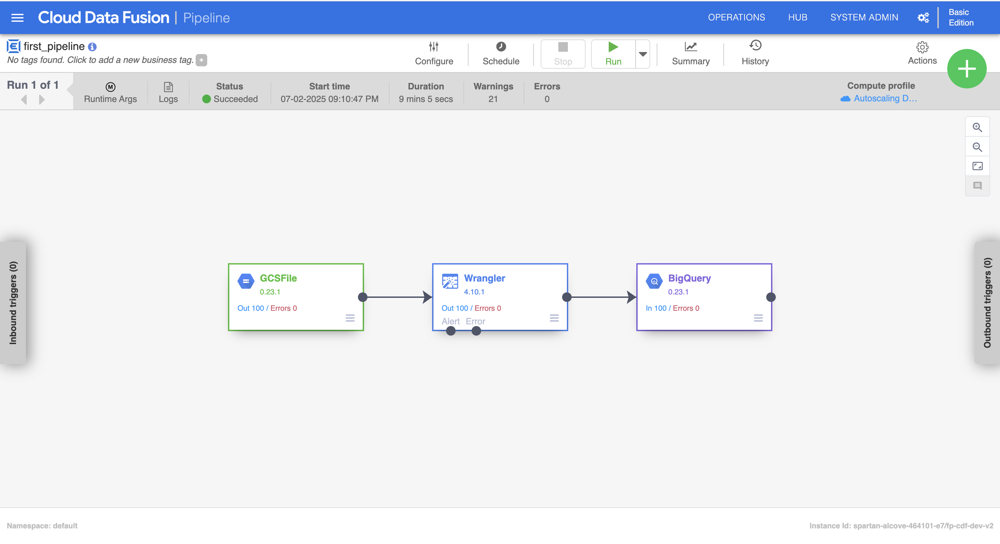
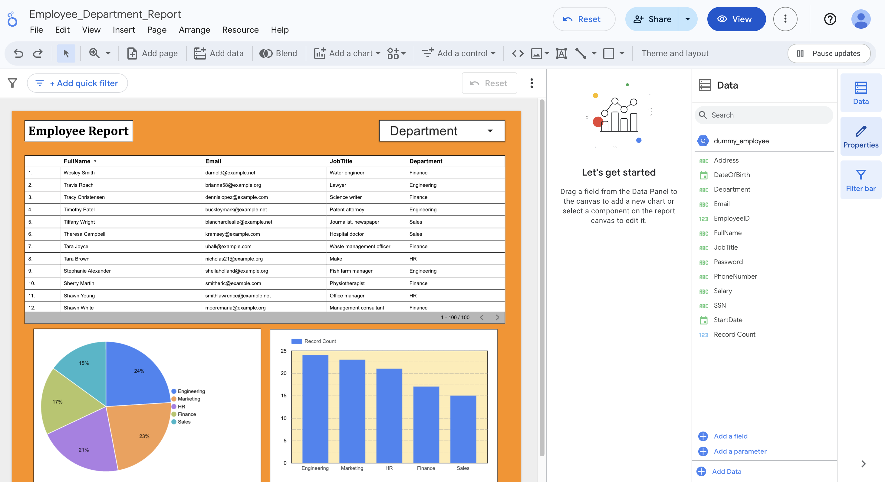
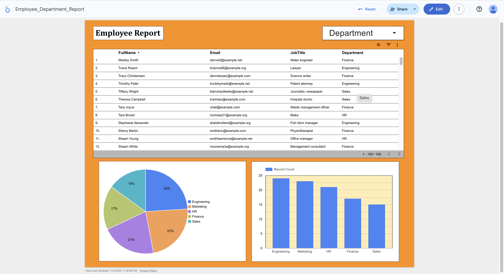

# GCP Loading Dummy Employee Data: End-to-End Data Pipeline

This project demonstrates an end-to-end data engineering pipeline built using **Google Cloud Platform (GCP)**. It simulates dummy employee data processing using Python, Google Cloud Storage (GCS), Cloud Data Fusion, BigQuery, and Looker Studio.

---

## 📌 Project Summary

| Layer          | Tool/Service                     |
|----------------|----------------------------------|
| Development    | Python, Faker, VS Code           |
| Storage        | Google Cloud Storage (GCS)       |
| Pipeline       | Cloud Data Fusion                |
| Warehouse      | BigQuery                         |
| BI Reporting   | Looker Studio (formerly Data Studio) |
| Security       | IAM Service Account              |
| GitHub         | Code Hosting and Documentation   |

---
## 💻 Tech Stack

&nbsp;  
&nbsp; 

## 📁 Project Architecture
Designed using draw.io, which provides rich cloud architecture icons for GCP, AWS, Azure, and Oracle.

&nbsp;  
&nbsp; 

# Step 1: Create Google Cloud Storage (GCS) - Bucket

<strong>Click Me</strong>

  
✅ Actions:
1. Go to GCP Console → Cloud Storage → Create a bucket
2. Name your bucket, e.g., fp_employee_bucket
3. Ensure it's set to Multi-region (e.g., us) and Standard Storage
4. Grant access using a Service Account with Storage Admin role
5. Upload after generating the CSV file using your Python script or manually via console. I have uploaded using python code.

&nbsp;  
&nbsp; 

# Step 2: Create Cloud Data Fusion - Instance

<strong>Click Me</strong>

  
✅ Actions:
1. In GCP Console → Search Cloud Data Fusion → Click Create Instance
2. Name it (e.g., fp-cdf-dev) and choose Basic edition
3. Wait around ~20 minutes for setup → Click Launch Instance

&nbsp;  
&nbsp; 

# Step 3: IAM & Permissions - Service Account

<strong>Click Me</strong>

  
✅ Actions:
1. Go to IAM & Admin → Create a Service Account
2. Assign the following roles:
  • Storage Admin (GCS access)
  • BigQuery Data Editor (BQ sink)
  • Data Fusion Runner or Editor (pipeline execution)
3. Download/Copy the service account JSON key to authenticate in Python:

&nbsp;  
&nbsp; 

# Step 4: Generate and Upload Dummy Employee Data using Python 

<strong>Click Me</strong>

✅ Actions:
1. Open Visual Studio Code, create a new folder for your project, and create a file named *extract.py*.
2. Install the required library using pip:
`
    pip install faker google-cloud-storage
`
4. Write the Python code to generate dummy employee data, including sensitive information such as "Passwords, Salary, and SSN".
5. Update the script with your GCS bucket name and service account credentials (JSON key file) to authenticate.
6. Run the script. It will:  
   • Generate the dummy data  
   • Save it as `dummy_employee_data.csv` 
6. Upload it directly into your Google Cloud Storage bucket.
7. Confirm that the file appears in your specified bucket under GCP Console.

&nbsp;  
&nbsp; 

 

# Step 5: Create BigQuery - Dataset

<strong>Click Me</strong>

  
✅ Actions:
1. Go to GCP Console → Search BigQuery
2. Create a dataset: employee
  • Create a table: dummy_employee
4. You can also let the BigQuery Sink auto-create the table
5. After pipeline execution, preview data and schema in the BigQuery console
   
&nbsp;  
&nbsp; 

# Step 6: Create ETL Pipeline in Cloud Data Fusion

<strong>Click Me</strong>

** Data Masking (Using Wrangler)
1. Since we’re dealing with sensitive data (Password, SSN, Salary)
2. Use the Wrangler component to mask or hash sensitive fields
3. Click the dropdown on the column → Choose "Mask" or use "Encode using SHA256/MD5"
   
** Create the Pipeline:
1. In the pipeline canvas:
  • Source: GCS (CSV path)
  • Wrangler: Transform/mask fields
  • Sink: BigQuery
2. Click on each node and verify schema compatibility
*Note*: Make sure the schema in source, wrnagler and sink are same by selecting the propeties of each.

**Validate the pipeline and deploy

1. Click the "Deploy" button on the top-right corner of the pipeline canvas.
2. After successful deployment, click "Run" to execute the pipeline.
3. Monitor the execution logs for any errors. If there are no issues, the pipeline will complete successfully and load the transformed data into BigQuery.
*Note*: Execution time may vary depending on the volume of data being processed.
   
&nbsp;  
&nbsp; 

# Step 7: Visualize Data Using Looker Studio

<strong>Click Me</strong>

  
✅ Actions:
Open https://lookerstudio.google.com

1. Go to Looker Studio
2. Click "Blank Report" → Add Data Source → Choose BigQuery
3. Select:
  • Project → Dataset → Table (dummy_employee)
4. Create reports:
  • Pie Chart: Job Titles
  • Bar Chart: Salary Ranges
  • Table: Employees by Department

5. Customize visual styling (color, fonts, etc.)

&nbsp;  
&nbsp; 

&nbsp;  
&nbsp; 

 
 
 
 
🙋 Author 
Ganesh Surisetty 
Data Engineer 
📧 ganeshsurisetty1@gmail.com 
🔗 [LinkedIn](https://www.linkedin.com/in/ganeshsurisetty/)
